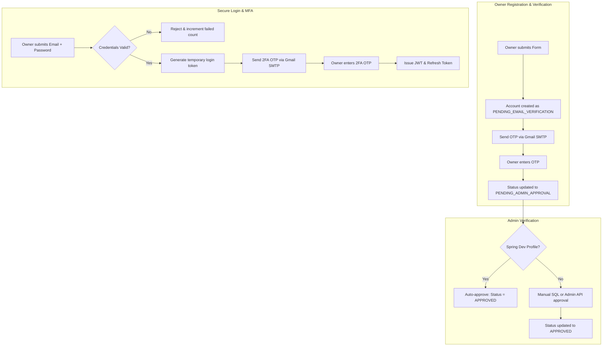
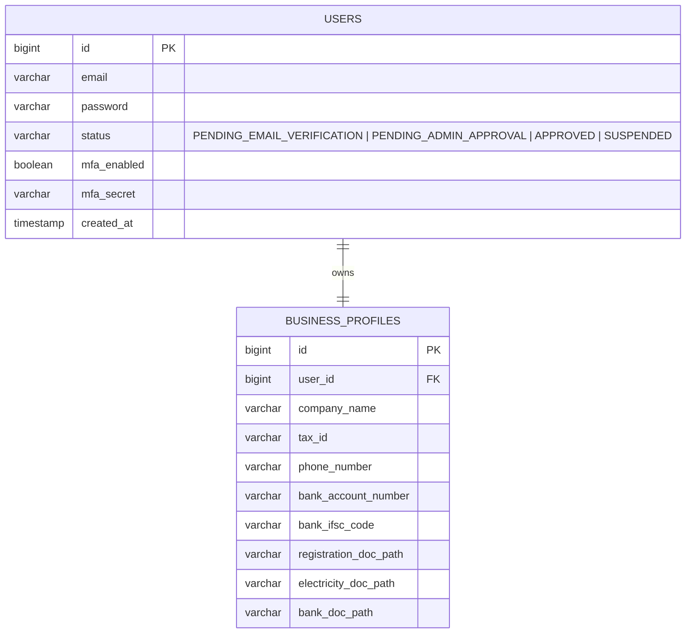

# Technical Specification: Pump Owner Registration, Verification, & MFA Login

This document outlines the detailed system architecture, database changes, backend API endpoints, and configuration settings required to implement a secure, verified authentication system for **Pump Owners** (Station Owners) in the EV Charging Management System.

---

## 1. System Overview

To secure the station owner accounts (since they handle billing, hardware control, and revenue payouts), we are transitioning from simple self-registration to a multi-stage **Verified Business Flow**:



---

## 2. Configuration Requirements

### A. Spring Boot Dependencies (`pom.xml`)
The backend must include the Spring Starter Mail dependency:
```xml
<dependency>
    <groupId>org.springframework.boot</groupId>
    <artifactId>spring-boot-starter-mail</artifactId>
</dependency>
```

### B. Gmail SMTP Configuration (`application-dev.properties` & `application-prod.properties`)
To send real emails using Gmail SMTP, configure the properties below. 
> [!IMPORTANT]
> The `spring.mail.password` must be a **Gmail App Password** (16 characters, no spaces) generated under Google Account → Security → 2-Step Verification → App passwords.

```properties
# spring.mail.host configuration
spring.mail.host=smtp.gmail.com
spring.mail.port=587
spring.mail.username=your-system-email@gmail.com
spring.mail.password=${GMAIL_APP_PASSWORD}
spring.mail.properties.mail.smtp.auth=true
spring.mail.properties.mail.smtp.starttls.enable=true
spring.mail.properties.mail.smtp.starttls.required=true
spring.mail.properties.mail.smtp.connectiontimeout=5000
spring.mail.properties.mail.smtp.timeout=5000
spring.mail.properties.mail.smtp.writetimeout=5000

# OTP parameters
app.auth.otp-expiration-minutes=5
app.auth.mfa-enabled=true
```

---

## 3. Database Schema Changes

We will modify the `users` table and add a new `business_profiles` table to capture business metadata and maintain security states.



### A. Flyway Migration Script (`V4__owner_auth.sql`)
```sql
-- Add status and MFA columns to users table
ALTER TABLE users ADD COLUMN IF NOT EXISTS status VARCHAR(50) DEFAULT 'APPROVED';
ALTER TABLE users ADD COLUMN IF NOT EXISTS mfa_enabled BOOLEAN DEFAULT FALSE;
ALTER TABLE users ADD COLUMN IF NOT EXISTS mfa_secret VARCHAR(100) DEFAULT NULL;

-- Set existing customer/admin accounts to APPROVED
UPDATE users SET status = 'APPROVED' WHERE status IS NULL;

-- Create business_profiles table
CREATE TABLE IF NOT EXISTS business_profiles (
    id BIGSERIAL PRIMARY KEY,
    user_id BIGINT UNIQUE NOT NULL,
    company_name VARCHAR(150) NOT NULL,
    tax_id VARCHAR(50) NOT NULL,
    phone_number VARCHAR(20) NOT NULL,
    bank_account_number VARCHAR(50) NOT NULL,
    bank_ifsc_code VARCHAR(30) NOT NULL,
    registration_doc_path VARCHAR(255),
    electricity_doc_path VARCHAR(255),
    bank_doc_path VARCHAR(255),
    CONSTRAINT fk_business_profile_user FOREIGN KEY (user_id) REFERENCES users(id) ON DELETE CASCADE
);
```

---

## 4. Document Storage Strategy: Supabase Storage

Instead of saving business documents locally on the server filesystem, all files must be stored in **Supabase Storage** under the files bucket to ensure horizontal scalability and cloud persistence.

*   **Bucket Name:** `business-documents`
*   **Security Access Policy (RLS):**
    *   **Upload (Insert):** Allowed for authenticated users with role `STATION_OWNER` or `ADMIN`.
    *   **Read (Select):** Allowed only for the owning owner (`auth.uid() = user_id`) and users with role `ADMIN`.
*   **Storage Path Convention:**
    *   `owner-{userId}/registration_doc_{timestamp}.pdf`
    *   `owner-{userId}/electricity_doc_{timestamp}.pdf`
    *   `owner-{userId}/bank_doc_{timestamp}.pdf`
*   **Database Record:** Save the generated **Supabase Storage Public URL** or **Relative Object Path** in the respective columns (`registration_doc_path`, `electricity_doc_path`, `bank_doc_path`) of the `business_profiles` table.

---

## 5. Backend REST API Specifications

All endpoints are prefix-mapped to `/api/auth` or `/api/admin`. Input request payloads use JSON format, and document uploads use `multipart/form-data`.

### A. Registration Initiator
*   **Endpoint:** `POST /api/auth/register/owner`
*   **Request Type:** `multipart/form-data`
*   **Payload Params:**
    *   `name` (String, required)
    *   `email` (String, required)
    *   `password` (String, required)
    *   `companyName` (String, required)
    *   `taxId` (String, required)
    *   `phoneNumber` (String, required)
    *   `bankAccountNumber` (String, required)
    *   `bankIfscCode` (String, required)
    *   `registrationDoc` (MultipartFile, required)
    *   `electricityDoc` (MultipartFile, required)
    *   `bankDoc` (MultipartFile, required)
*   **Processing Rules:**
    1.  Validate email uniqueness in `users`.
    2.  Create `User` with `role = User.Role.STATION_OWNER` and `status = PENDING_EMAIL_VERIFICATION`.
    3.  Upload files to the Supabase Storage `business-documents` bucket.
    4.  Save the resulting Supabase Storage URLs/Object paths in the `BusinessProfile` table.
    5.  Generate a 6-digit verification OTP and cache it in Redis/Memory with a 5-minute TTL.
    6.  Send the OTP to the user's email using the Gmail SMTP service.
*   **Success Response:** `200 OK`
    ```json
    {
        "success": true,
        "message": "Registration initiated. Verification OTP sent to email.",
        "data": { "userId": 12 }
    }
    ```

### B. Verify Registration Email OTP
*   **Endpoint:** `POST /api/auth/verify-registration`
*   **Request Type:** `application/json`
*   **Payload:**
    ```json
    {
        "userId": 12,
        "otp": "123456"
    }
    ```
*   **Processing Rules:**
    1.  Validate OTP correctness and expiration.
    2.  Update status based on environment profile:
        *   If `activeProfile == "dev"`, auto-approve: `status = APPROVED`.
        *   Otherwise: `status = PENDING_ADMIN_APPROVAL`.
*   **Success Response:** `200 OK`
    ```json
    {
        "success": true,
        "message": "Email verified successfully.",
        "data": { "status": "APPROVED" }
    }
    ```

### C. Admin Approval Endpoint
*   **Endpoint:** `PUT /api/admin/users/{userId}/approve`
*   **Authorization:** Require role `ADMIN`
*   **Processing Rules:**
    1.  Fetch user and assert role is `STATION_OWNER`.
    2.  Update user status to `APPROVED`.
*   **Success Response:** `200 OK`
    ```json
    {
        "success": true,
        "message": "Pump Owner approved successfully."
    }
    ```

### D. Multi-Factor Authentication (MFA) Login Initiator
*   **Endpoint:** `POST /api/auth/login`
*   **Request Type:** `application/json`
*   **Payload:**
    ```json
    {
        "email": "owner@example.com",
        "password": "securepassword"
    }
    ```
*   **Processing Rules:**
    1.  Authenticate password via BCrypt.
    2.  Assert user status is `APPROVED`. If `status` is `PENDING_ADMIN_APPROVAL`, return `403 Forbidden` ("Account pending admin approval").
    3.  Check if `mfa_enabled` is true. If false, bypass MFA and return final tokens immediately.
    4.  If MFA is active:
        *   Generate a short-lived random token (temporary login session).
        *   Generate a 6-digit MFA OTP and cache it (5-minute TTL).
        *   Send the OTP to the user's email via Gmail SMTP.
*   **Success Response (With MFA Active):** `200 OK`
    ```json
    {
        "success": true,
        "message": "MFA code sent to email.",
        "data": {
            "mfaRequired": true,
            "tempLoginToken": "temp-uuid-session-token"
        }
    }
    ```

### E. Verify MFA OTP
*   **Endpoint:** `POST /api/auth/verify-mfa`
*   **Request Type:** `application/json`
*   **Payload:**
    ```json
    {
        "tempLoginToken": "temp-uuid-session-token",
        "otp": "654321"
    }
    ```
*   **Processing Rules:**
    1.  Validate temporary login session and retrieve the corresponding user.
    2.  Validate OTP match and expiration.
    3.  Issue final JWT Token, Refresh Token, and User payload.
*   **Success Response:** `200 OK`
    ```json
    {
        "success": true,
        "message": "MFA verified. Login successful.",
        "data": {
            "token": "eyJhbGciOiJIUzI1NiJ9...",
            "refreshToken": "ref-token-uuid",
            "user": { "id": 12, "email": "owner@example.com", "role": "STATION_OWNER" }
        }
    }
    ```

---

## 6. Development & Testing Bypass Implementations

To allow seamless local development without real documents or emails:

1.  **Dev Profile Auto-Approval:**
    Ensure that registration verification bypasses manual approval when run locally:
    ```java
    if ("dev".equals(activeSpringProfile)) {
        user.setStatus(UserStatus.APPROVED);
    } else {
        user.setStatus(UserStatus.PENDING_ADMIN_APPROVAL);
    }
    ```
2.  **Dev Profile OTP Exposure:**
    If `otp.expose-in-response=true`, return the generated OTP in the REST responses of `/api/auth/register/owner` and `/api/auth/login` so testing agents can read it directly from the JSON payload.
3.  **Local Mock Files:**
    Allow uploading tiny placeholder files (e.g. `test.txt` instead of actual PDFs/Images). Keep validation checks strictly on file existence, rather than size or extension constraints.
4.  **UI Quick-Fill Button (React):**
    On the owner registration form, add a button visible only when `process.env.NODE_ENV === 'development'`:
    ```javascript
    const handleAutofill = () => {
        setFormData({
            name: "Test Pump Owner",
            email: "owner_test_" + Date.now() + "@ev.com",
            password: "password123",
            companyName: "Dev Stations Ltd",
            taxId: "GSTIN-DEV-12345",
            phoneNumber: "9999988888",
            bankAccountNumber: "1234567890",
            bankIfscCode: "IFSC0001234"
        });
        setMockFiles(true); // Automatically attach mock blobs for uploads
    };
    ```
